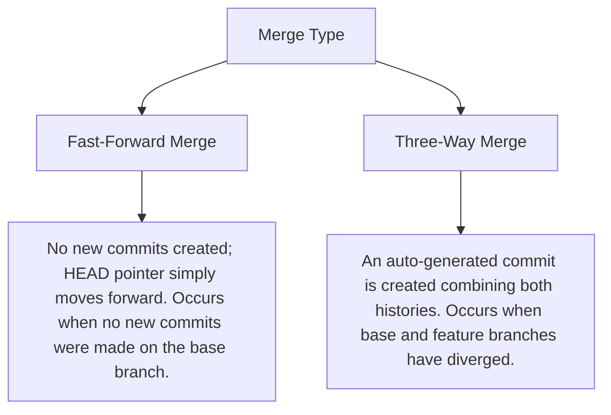

# 10. Merging vs. Rebasing Basics

Integrating changes from one branch into another is a core workflow in Git. Git provides two primary ways to do this: **Merging** and **Rebasing**. While both serve the same goal, they achieve it in vastly different ways, and choosing between them depends on your team's workflow.

---

## Merging: Integrating via a Safe History

Merging takes the content of a source branch and integrates it into a target branch. It is a **destructive-free** operation: history is not modified or rewritten.

### 1. Merge a Branch
##### Purpose:
Combines the history of a specified branch into your current active branch.

##### Syntax:
```bash
git merge <branch-name>
```

##### Real-world Example:
```bash
git switch main
git merge feature/login-page
```

---

### 2. View Merged Branches
##### Purpose:
Lists all branches whose commits have been fully integrated into your current branch (safe to delete).

##### Syntax:
```bash
git branch --merged
```

---

### Types of Merges



---

## Rebasing: Creating a Clean, Linear History

Rebasing is the process of moving or combining a sequence of commits to a new base commit. Instead of creating a merge commit, it rewrites the commit history by applying your local commits one-by-one on top of the target branch's newest commit.

### 3. Rebase onto Another Branch
##### Purpose:
Reapplies commits from your current active branch on top of the specified branch's newest commit.

##### Syntax:
```bash
git rebase <target-branch-name>
```

##### Real-world Example:
```bash
# While working on feature/auth, get new changes from main linearly:
git switch feature/auth
git rebase main
```

---

### 4. Manage Rebase Progress
##### Purpose:
Handles conflicts or exits a rebase operation.

##### Syntax:
```bash
# Abort the rebase and return your branch to its exact pre-rebase state
git rebase --abort

# Continue the rebase after manually resolving a conflict and staging the file
git rebase --continue
```

---

## The Golden Rule of Rebasing

> [!CAUTION]
> **Never rebase commits that have been pushed to a public or shared repository!**
> Rebasing rewrites commit hashes. If you rebase public commits, collaborators who pulled your original commits will see their history break, leading to major merge conflicts and duplicate commits. Only rebase local, unpushed commits to clean up your work before sharing it.

---

## Merging vs. Rebasing Comparison

| Operation | History Impact | Conflict Resolution | Use Case | Pros/Cons |
| :--- | :--- | :--- | :--- | :--- |
| **Merge** | Preserves original history exactly as it happened. | Resolved once in a single merge commit. | Standard integration, team sharing, public branches. | **Pros**: Non-destructive, complete audit trail.<br>**Cons**: Commit graph can become cluttered with "merge commits". |
| **Rebase** | Rewrites history to make it completely linear. | Resolved commit-by-commit as they are reapplied. | Cleaning up local branch before opening PR or merging. | **Pros**: Beautiful, clean, linear history.<br>**Cons**: Rewrites history, dangerous on public branches. |

---

## Common Mistakes & Solutions

### Mistake: Force Pushing to Public `main` after Rebase
**Problem**: You rebased local `main` onto some other branch and now you cannot push to GitHub without using `--force`.
**Solution**: **Stop!** If others are pulling from `main`, do not force push. Undo your rebase using reflog:
```bash
# Locate the commit ID before rebase in reflog
git reflog
# Reset your local branch back to the pre-rebase commit
git reset --hard HEAD@{number}
```

---

## Best Practices
- **Rebase locally, merge publicly**: Use `git rebase` to keep your local feature branch up to date with `main` while you work. When the feature is complete and ready to be integrated into the public repository, use `git merge` (or squash merge via Pull Request) to preserve the integration point.
