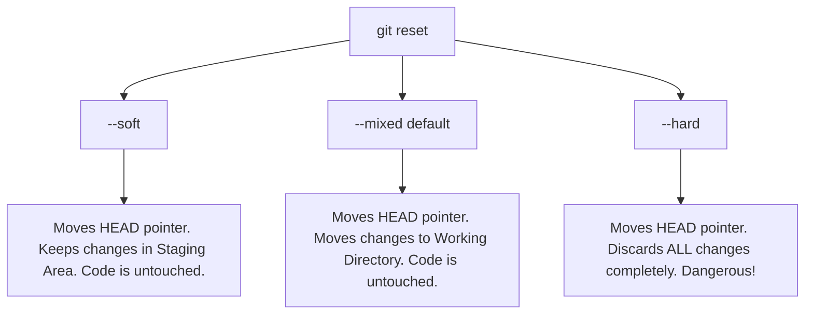

# 11. Undoing Changes: Reset vs. Revert

Making mistakes is a natural part of coding. Git is designed to be a time machine, giving you multiple ways to undo mistakes depending on whether they are unstaged, staged, committed, or pushed to a remote server. The two primary commands for undoing commits are **Reset** and **Revert**.

---

## The Undoing Toolkit

### 1. Discard Uncommitted Changes in a File
##### Purpose:
Discards local edits in your working directory and restores the file to the state of the last commit.

##### Syntax:
```bash
git restore <filename>
# OR (Legacy syntax)
git checkout HEAD <filename>
```

##### Real-world Example:
```bash
git restore src/App.js
```

---

### 2. Clean Untracked Files (Git Clean)
##### Purpose:
Removes untracked files and directories from your working directory. Perfect for cleaning up auto-generated files.

##### Syntax:
```bash
# Dry run: lists what files would be deleted without actually deleting them (SAFE!)
git clean -n

# Force delete untracked files
git clean -f

# Force delete untracked files AND directories
git clean -fd
```

---

## Resetting: Rewriting the Local Pointer

`git reset` moves the current branch HEAD pointer to a previous commit. This rewrites history locally.

### 3. Git Reset Modes Explained

There are three main modes for `git reset`. They determine what happens to your active code after the pointer is moved:



---

### 4. Git Reset Syntax
##### Syntax:
```bash
git reset [--soft | --mixed | --hard] <commit-hash-or-reference>
```

##### Real-world Examples:
```bash
# Undo the last commit, but keep your modifications staged
git reset --soft HEAD~1

# Unstage files from the staging area (undo the last 'git add')
git reset HEAD

# Completely obliterate your last 3 commits and discard all code modifications
git reset --hard HEAD~3

# Reset your local branch to match the remote branch state exactly
git reset --hard origin/main
```

> [!CAUTION]
> `git reset --hard` is one of the few truly destructive Git commands. Any unstaged changes in your working directory will be permanently lost. Use with absolute care.

---

## Reverting: Safely Undoing Shared Commits

`git revert` undoes a commit by generating a **brand new commit** that introduces the exact opposite changes. It is a completely safe, history-preserving operation.

### 5. Revert a Commit
##### Purpose:
Undoes the changes of an existing commit safely on public branches.

##### Syntax:
```bash
git revert <commit-hash>
```

##### Real-world Example:
```bash
git revert a8f2c3b
```

---

## Reset vs. Revert Comparison

| Criteria | `git reset` | `git revert` |
| :--- | :--- | :--- |
| **Primary Mechanism** | Moves HEAD pointer backward (rewrites history). | Creates a new commit with opposite changes (extends history). |
| **History Safe?** | **No** (Deletes/orphans subsequent commits). | **Yes** (Safe for public/shared branches). |
| **Working Directory Impact** | Depends on mode (`--hard` deletes edits). | Does not delete unstaged local edits. |
| **Typical Use Case** | Cleaning up local commits before pushing. | Undoing a buggy commit already pushed to `origin/main`. |

---

## Common Mistakes & Solutions

### Mistake 1: Resetting Pushed Commits
**Problem**: You did `git reset --hard HEAD~2` and pushed to GitHub, but the push was rejected because you rewrote history.
**Solution**: **Do not force push!** If others have pulled, your force push will break their history. Instead, pull to restore the commits, and then use `git revert` for each of the bad commits.

### Mistake 2: Accidentally staging files that should be ignored
**Problem**: Staged or committed files that should have been ignored by `.gitignore`.
**Solution**: Remove them from tracking while keeping them locally:
```bash
git rm -r --cached .
git add .
git commit -m "chore: remove tracked files now in gitignore"
```
This forces Git to re-read `.gitignore` and stop tracking those files!

---

## Best Practices
- **"Reset local, Revert public"**: This is the golden rule of undoing in Git.
- **Always run `git status` before `--hard`**: Make sure your working directory is clean before running `git reset --hard` to avoid losing uncommitted work.
