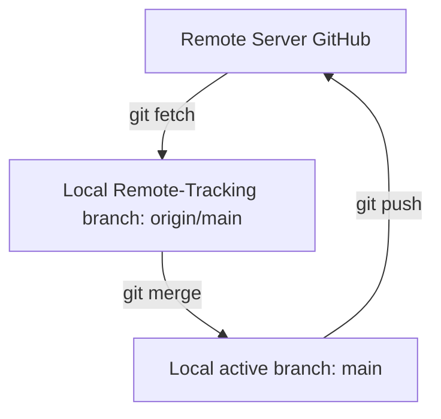

# 12. Working with GitHub Repositories

GitHub is a cloud hosting platform for Git repositories. Connecting local repositories to GitHub allows you to save backups, share code, and collaborate with developers worldwide. There are three common ways to establish this link.

---

## Establishing GitHub Connections

### Scenario A: Build a New Repository from Scratch (HTTPS/SSH link)
Use this when you have a folder of code locally that you want to put onto a fresh, empty GitHub repository.

##### Step-by-Step Workflow:
1. Create a new repository on your GitHub account (do not initialize with README or license).
2. Initialize Git locally and create your files:
   ```bash
   git init
   git add .
   git commit -m "initial commit"
   ```
3. Link your local repo to GitHub by naming the remote `origin`:
   ```bash
   git remote add origin <github-repo-url>
   ```
4. Verify the remote connection:
   ```bash
   git remote -v
   ```
5. Push your code to GitHub and set tracking with `-u` (upstream):
   ```bash
   git push -u origin main
   ```

---

### Scenario B: Start by Cloning an Existing GitHub Repository
Use this when a repository already exists on GitHub and you want to download it locally to start working.

##### Step-by-Step Workflow:
1. Copy the URL (HTTPS or SSH) of the GitHub repository.
2. Clone the repository locally:
   ```bash
   git clone <github-repo-url>
   ```
   > [!NOTE]
   > Cloning automatically names the remote `origin` and sets up tracking between your local default branch and the remote default branch.
3. Navigate into the cloned folder, edit code, stage, and commit:
   ```bash
   cd <repo-folder-name>
   # Make your changes
   git commit -am "first local commit"
   ```
4. Push updates directly to the server:
   ```bash
   git push
   ```

---

### Scenario C: Link a Pre-existing Local Git Repository to GitHub
Use this if you already have a local Git repository with commit history that you want to host on a new GitHub repository.

##### Step-by-Step Workflow:
1. Create a fresh, empty repository on GitHub.
2. Link the repository:
   ```bash
   git remote add origin <github-repo-url>
   ```
3. Rename your local default branch to `main` (if it is currently `master`):
   ```bash
   git branch -M main
   ```
4. Push and set upstream:
   ```bash
   git push -u origin main
   ```

---

## The `origin/main` Tracking Theory

When you link a local repository to GitHub, Git introduces a unique concept called **Remote Tracking Branches**.

- **`main`**: Your active local branch.
- **`origin/main`**: A local read-only pointer representing the exact state of the `main` branch on the remote server (`origin`) the last time you communicated with it (via `git fetch`, `git pull`, or `git push`).



### Navigating Remote Tracking Branches

##### 1. List all remote-tracking branches:
```bash
git branch -r
```

##### 2. Check out the remote-tracking state directly:
```bash
git checkout origin/main
```
> [!WARNING]
> Checking out `origin/main` puts you in a **Detached HEAD** state because it is read-only. Any commits made here will not be attached to any branch and can easily be lost. Always switch back to your local `main` branch to resume editing:
> ```bash
> git switch main
> ```

---

### Syncing Multi-Branch Clones

When you clone a repository that has multiple branches on GitHub, running `git branch` initially only lists `main`. Do not worry! Git has downloaded all branches.

To start working on a remote branch (e.g. `feature-login`):
1. List all branches downloaded from the remote:
   ```bash
   git branch -a
   ```
2. Simply switch to the branch name:
   ```bash
   git switch feature-login
   ```
   Git will automatically detect that `feature-login` exists on `origin` and will create a local branch of the same name and set up tracking automatically!

---

## Best Practices
- **Configure default branch to `main`**: Set `main` as the default branch name in your global Git configurations:
  ```bash
  git config --global init.defaultBranch main
  ```
- **Use SSH key authentication**: Set up SSH keys rather than HTTPS to avoid typing credentials or developer tokens repeatedly.
