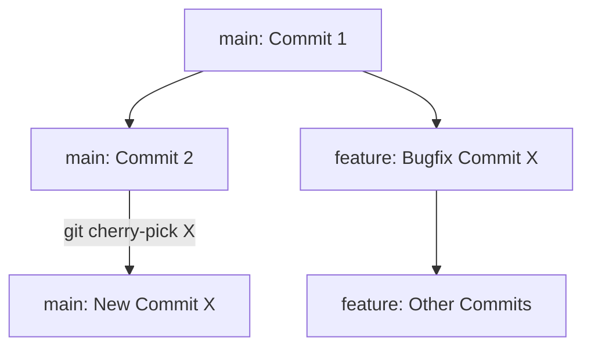
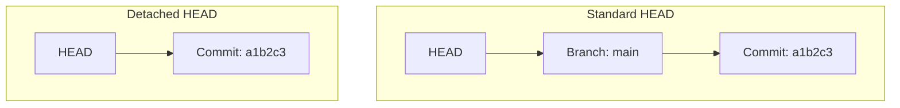

# 17. Git Cherry-Pick, Reflog & Detached HEAD

This chapter covers some of Git's most specialized "time travel" and recovery commands. You will learn how to selectively copy individual commits from one branch to another (Cherry-Pick), recover seemingly "deleted" commits or branch states using the Reference Log (Reflog), and navigate the "Detached HEAD" state safely.

---

## Git Cherry-Pick: Selectively Applying Commits

Cherry-picking allows you to grab a specific commit from one branch and apply it to your current active branch as a new commit. This is ideal when you want a bug fix or feature from another branch without merging the entire branch history.



### 1. Apply a Specific Commit
##### Purpose:
Copies a specific commit from another branch and commits it to your active branch.

##### Syntax:
```bash
git cherry-pick <commit-hash>
```

##### Real-world Example:
```bash
git switch main
git cherry-pick 3a5b7c8
```

---

### 2. Cherry-Pick Without Committing
##### Purpose:
Applies the changes from a remote commit to your working tree and staging area directly without auto-committing. This lets you inspect or edit the changes first.

##### Syntax:
```bash
git cherry-pick -n <commit-hash>
# OR
git cherry-pick --no-commit <commit-hash>
```

---

## Git Reflog: The Local Safety Net

Git tracks all actions you perform locally (switching branches, committing, hard resetting, rebasing) inside the **Reference Log**. This is your ultimate safety net: even if you delete a branch or perform a destructive `git reset --hard` that removes commits from history, the Reflog retains a record of where HEAD was.

### 3. View the Reference Log
##### Purpose:
Displays the complete sequence of actions of your local HEAD pointer.

##### Syntax:
```bash
git reflog
```

##### Real-world Output:
```text
c3b4a2e HEAD@{0}: reset: moving to HEAD~1
8f9e1d2 HEAD@{1}: commit: feat: build login ui
a1b2c3d HEAD@{2}: checkout: moving from main to feature/auth
```

---

### 4. Restore a Deleted Commit or Hard Reset
##### Purpose:
Rescues code that was lost due to a hard reset or branch deletion by pointing HEAD back to an older state in the Reflog.

##### Syntax:
```bash
git reset --hard <reflog-reference-or-hash>
```

##### Real-world Example:
If you ran `git reset --hard HEAD~1` by mistake and lost your `feat: build login ui` commit:
1. Run `git reflog` and locate the hash prior to the reset: `8f9e1d2 HEAD@{1}: commit: feat: build login ui`.
2. Restore it:
   ```bash
   git reset --hard HEAD@{1}
   # OR
   git reset --hard 8f9e1d2
   ```
Your lost code is fully restored!

---

## Demystifying Detached HEAD

HEAD is a pointer that usually points to a named branch (like `main`), which in turn points to the latest commit. A **Detached HEAD** state occurs when HEAD is pointed directly to a specific commit hash rather than a named branch.



### Causes of Detached HEAD
- Running `git checkout <commit-hash>` to view an older commit.
- Checking out a remote-tracking branch (`git checkout origin/main`).
- Checking out a tag (`git checkout v1.0.0`).

### Navigating a Detached HEAD State

> [!WARNING]
> While in a Detached HEAD state, you can edit and make commits safely. However, **these commits are not associated with any branch**. If you switch back to `main`, those new commits will become orphaned, making them targets for Git's garbage collection (permanent deletion) after some time.

#### How to Save Your Commits in Detached HEAD
If you made commits while in Detached HEAD and want to preserve them:
1. Make a new branch immediately from your current detached location:
   ```bash
   git switch -c recovery-branch
   ```
This attaches HEAD to your new branch, securing all commits you just made!

---

## Best Practices
- **Never cherry-pick extensively**: Doing so can create duplicate commits and confusing branches. If you need many commits, perform a standard branch merge instead.
- **Act quickly with Reflog**: Git's garbage collection removes orphaned commits after 30 to 90 days. Run `git reflog` immediately to recover deleted commits before they are permanently erased.
