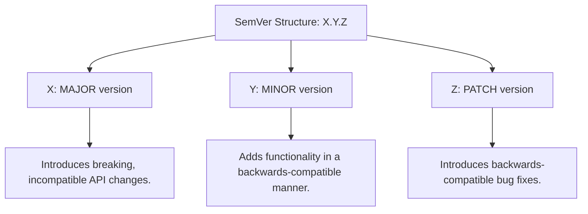

# 19. Advanced Tags & Semantic Versioning

In production environments, releasing software involves marking specific commits as official release versions. While basic tagging is simple, managing stable software deployment requires understanding advanced tagging commands, sharing tags with remote environments, and adopting the industry-standard **Semantic Versioning (SemVer)** system.

---

## Core Tag Management

### 1. Show Tag Details
##### Purpose:
Displays the complete author details, date, annotation message, and target commit hash of an annotated tag.

##### Syntax:
```bash
git show <tag-name>
```

##### Real-world Example:
```bash
git show v1.0.0
```

---

### 2. Retagging (Moving an Existing Tag)
##### Purpose:
Moves an existing tag to a different commit (by default, Git prevents overwriting a tag pointer).

##### Syntax:
```bash
git tag -f <tag-name> <commit-hash>
```

##### Real-world Example:
```bash
git tag -f v1.0.0 a8d3f1c
```

---

### 3. Deleting Remote Tags
##### Purpose:
Deletes a tag from the remote server after deleting it locally.

##### Syntax:
```bash
# Step 1: Delete tag locally
git tag -d <tag-name>

# Step 2: Delete tag on remote
git push <remote> --delete <tag-name>
# OR (Legacy syntax)
git push <remote> :refs/tags/<tag-name>
```

##### Real-world Example:
```bash
git tag -d v1.0.0
git push origin --delete v1.0.0
```

---

## Understanding Semantic Versioning (SemVer)

Semantic Versioning is a formal specification for software version numbers. A SemVer version number is structured as:

$$\mathbf{MAJOR}.\mathbf{MINOR}.\mathbf{PATCH}$$



### Real-world Examples:
- **`1.0.0`**: Your initial stable release.
- **`1.0.1`**: A minor bug fix (patch). Backwards-compatible.
- **`1.1.0`**: A new feature was added (minor release). Backwards-compatible.
- **`2.0.0`**: A major rewrite that breaks existing client integrations (breaking change).

---

## Production Release Tagging Workflow

This represents a professional team workflow for deploying a stable version.

#### Step 1: Checkout the Release Branch
Ensure you are on the clean `main` (or release) branch:
```bash
git switch main
git pull origin main
```

#### Step 2: Create a GPG Signed Annotated Tag (Highly Secure)
Sign the tag with your GPG key to verify the integrity and authenticity of the release:
```bash
git tag -s v2.1.0 -m "Release version 2.1.0 (Payment integration)"
```
*(If GPG is not configured, fallback to standard annotated tags: `git tag -a v2.1.0 -m "Release v2.1.0"`)*

#### Step 3: Push Tags to GitHub
Upload your local tags to GitHub. This will automatically trigger GitHub's Release Engine and any configured deployment pipelines (CI/CD):
```bash
git push origin v2.1.0
```

#### Step 4: Verify the Release on GitHub
1. Open your repository on GitHub.
2. Under the **Releases** tab, click **Draft a new release**.
3. Choose the tag `v2.1.0`, add a title (e.g. `Release v2.1.0`), autogenerate release notes, and publish!

---

## Common Mistakes & Solutions

### Mistake 1: Forgetting to Push Tags
**Problem**: You tagged a commit locally, ran `git push`, but your team members or deployment pipelines can't see the tag on GitHub.
**Solution**: Running `git push` only pushes code branches, not tags. You must push tags explicitly:
```bash
git push origin --tags
```

### Mistake 2: Changing a Pushed Tag
**Problem**: You pushed `v1.0.0`, realized there was a small bug, moved the tag locally, and forced pushed it. Team members who already pulled `v1.0.0` will have a cached local tag pointing to the old, broken commit, resulting in synchronization errors.
**Solution**: **Never rewrite pushed tags.** If there is a bug, create a patch release (`v1.0.1`) instead of rewriting `v1.0.0`.

---

## Best Practices
- **Use annotated tags for releases**: Lightweight tags are fine for quick local markers, but production releases must always use annotated tags (`git tag -a`) to record authorship, date, and release notes.
- **Automate releases**: Use tools like `semantic-release` or GitHub Actions to parse conventional commit messages and automate the generation of tags and SemVer bumps automatically.
