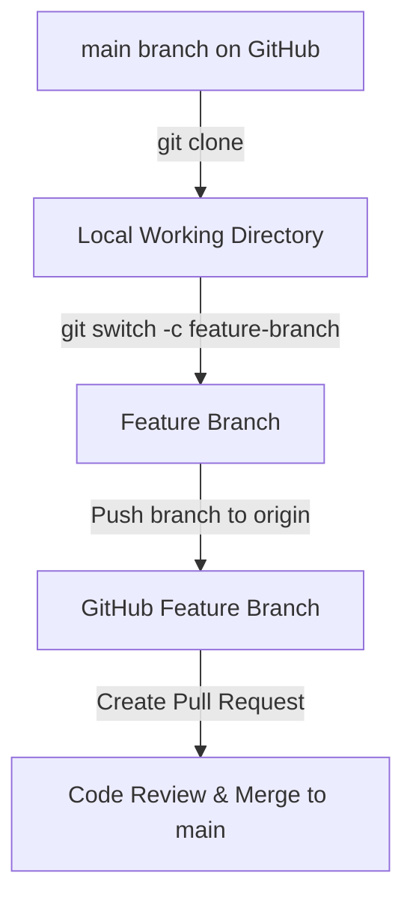
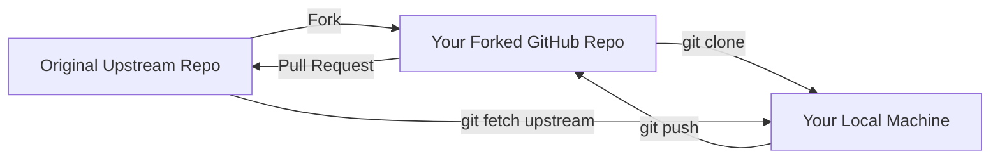

# 20. GitHub Collaboration, Forking & Pull Requests

Collaboration is at the heart of GitHub. Whether you are working within a closed engineering team or contributing to an open-source project, you will use pull requests, forks, and upstream syncing to share code safely.

---

## Team Pull Request Workflow (Feature Branches)

Used inside teams where developers have direct write access to the main repository.



### Step-by-Step Workflow:
1. Fetch latest changes and create a local feature branch:
   ```bash
   git switch main
   git pull origin main
   git switch -c feature/dark-theme
   ```
2. Write code, commit, and push branch to GitHub:
   ```bash
   git commit -am "feat: implement dark mode variables"
   git push -u origin feature/dark-theme
   ```
3. Open your web browser, navigate to the repository on GitHub, click **Compare & pull request**, write a description of your changes, and submit.
4. Once reviewed and approved by teammates, merge it into the main branch directly on GitHub.

---

## Open-Source Fork Workflow

Used when contributing to external or open-source repositories where you do **not** have write access to push branches directly.

### 1. The Fork and Upstream Infrastructure



---

### 2. Step-by-Step Fork Contribution Guide

#### Step 1: Fork the Repository
On the GitHub website page of the target project (e.g. `original-owner/project`), click the **Fork** button in the top right corner. This creates a duplicate copy of the repository under your own GitHub account (`your-username/project`).

#### Step 2: Clone Your Fork Locally
Clone your fork to your computer:
```bash
git clone https://github.com/your-username/project.git
cd project
```

#### Step 3: Link the Original Repository as "Upstream"
To pull updates from the original owner as they work, you must add their repository URL as a second remote named **`upstream`**:
```bash
git remote add upstream https://github.com/original-owner/project.git
```
Verify your remote configuration:
```bash
git remote -v
```
You should see:
- `origin` pointing to your personal fork (fetch & push).
- `upstream` pointing to the original repository (fetch & push).

---

#### Step 4: Create a Feature Branch
Always create a descriptive branch for your contribution:
```bash
git switch -c fix/docs-typo
```

#### Step 5: Write Code & Push to Your Fork (`origin`)
Commit your improvements and push the branch to **your personal fork** (you have write access here, but not to `upstream`):
```bash
git commit -am "docs: fix typo in installation guide"
git push -u origin fix/docs-typo
```

#### Step 6: Open a Pull Request to `upstream`
1. Go to your fork page on the GitHub website.
2. Click **Contribute** -> **Open Pull Request**.
3. GitHub will configure the PR to merge from your fork's branch (`your-username/project:fix/docs-typo`) into the original owner's default branch (`original-owner/project:main`).
4. Write a detailed description of your bug fix, and click **Create Pull Request**!

---

## Upstream Syncing (Keeping Fork Up-to-Date)

While you are working, the original owner will merge other PRs into the upstream repository. To prevent merge conflicts, you must sync your local fork frequently.

##### Purpose:
Fetches the newest commits from the original repository and integrates them into your active branch.

##### Syntax:
```bash
# Step 1: Switch to your local main branch
git switch main

# Step 2: Download the latest upstream commits
git fetch upstream

# Step 3: Merge upstream/main into local main
git merge upstream/main

# Step 4: Update your personal GitHub fork
git push origin main
```

---

## Best Practices
- **Never work on the `main` branch**: Always create feature branches. Working on `main` makes syncing with upstream extremely messy and leads to conflicts.
- **Sync before editing**: Always run the upstream syncing commands *before* you create a new feature branch to ensure your work starts from the latest updates.
- **Keep PRs small**: Do not open a PR containing thousands of lines of changes across 5 unrelated features. Keep PRs focused on single bugs or tasks for easy review.
