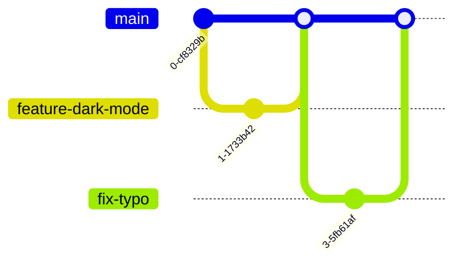

# 22. Advanced Workflows: Git Flow vs. Trunk-Based Development

In enterprise environments, branching structures are not created randomly. Software organizations adopt standard branching models (workflows) to manage features, bug fixes, releases, and deployments reliably. This chapter compares the two most popular Git branching strategies—**Git Flow** and **Trunk-Based Development**—and explores Git management in **Monorepo** systems.

---

## 1. The Git Flow Workflow

Git Flow is a highly structured, feature-rich branching model designed by Vincent Driessen. It is ideal for projects that have a formal release cycle (e.g. boxed software, scheduled enterprise deployments) where updates aren't pushed to production continuously.


### Git Flow Branch Hierarchy

1. **`main`**: Production-ready branch. Only contains stable release code. Every commit on `main` is tagged with a version number.
2. **`develop`**: The integration branch for features. This is where active feature work is consolidated before releasing.
3. **`feature/*`**: Isolated branches for building specific features (branched off `develop`, merged back into `develop`).
4. **`release/*`**: Temporary branches used to prepare a new production release, allowing for minor bug fixing and documentation tweaks (branched off `develop`, merged into both `main` and `develop`).
5. **`hotfix/*`**: Urgent bug-fix branches used to patch production bugs immediately without waiting for the release cycle (branched off `main`, merged into both `main` and `develop`).

---

### Core Git Flow CLI Reference
While you can run Git Flow manually using standard commands, a custom extension CLI (Git Flow AVH) automates the branching steps:

```bash
# Initialize git flow configuration inside your repo
git flow init -d

# --- Feature Workflow ---
# Start feature/stripe integration
git flow feature start stripe
# Finish and merge feature/stripe into 'develop', deleting the feature branch
git flow feature finish stripe

# --- Release Workflow ---
# Start release version 1.0.0
git flow release start 1.0.0
# Finish, merge release into main and develop, and tag it '1.0.0'
git flow release finish 1.0.0

# --- Hotfix Workflow ---
# Start hotfix for a production bug
git flow hotfix start login-patch
# Finish hotfix and merge back to main and develop
git flow hotfix finish login-patch
```

---

## 2. Trunk-Based Development (TBD)

Trunk-Based Development is the modern standard for high-performing engineering teams utilizing **Continuous Integration & Continuous Deployment (CI/CD)**. Instead of complex, long-lived branches, all developers collaborate on a single branch—the **Trunk** (usually `main`).



### Key Principles of TBD:
- **Short-lived branches**: Developers create feature branches that last a maximum of **1-2 days** before being integrated.
- **Small commits**: Small, frequent commits are merged into `main` throughout the day.
- **Feature Flags (Toggles)**: Features that are not yet complete are wrapped in conditional code variables (feature flags) so that unfinished code can be safely merged to production without showing up for users.

---

## Git Flow vs. Trunk-Based Development Comparison

| Feature | Git Flow | Trunk-Based Development |
| :--- | :--- | :--- |
| **Branch Complexity** | High (5+ branching tiers, complex merges). | Very Low (1-2 tiers, simple short-lived branches). |
| **Branch Longevity** | Long-lived (feature branches can last weeks). | Short-lived (branches last hours or days). |
| **Merge Frequency** | Low (infrequent, massive merges). | Extremely High (multiple daily integrations). |
| **CI/CD Alignment** | Poor (releases are scheduled and formal). | Perfect (continuous automated testing and deployment). |
| **Best Suited For** | Scheduled releases, embedded systems, open-source. | SaaS, Web Applications, agile startups. |

---

## 3. Monorepo Git Strategies

A **Monorepo** is a repository architecture where code for multiple separate projects (e.g. frontend app, backend API, shared utility packages) is stored inside a single, unified Git repository.

```text
my-monorepo/
├── apps/
│   ├── admin-dashboard/
│   └── public-website/
├── packages/
│   ├── shared-ui/
│   └── database-client/
├── .gitignore
└── package.json
```

### Handling Large Monorepos in Git
As monorepos scale, downloading gigabytes of historical commits becomes extremely slow. Git provides optimization strategies to solve this:

#### A. Sparse Checkout (Checkout only specific directories)
##### Purpose:
Tells Git to download metadata for the entire repo, but only download and display target folders in your working directory (e.g., you only want to work on `apps/admin-dashboard`).

##### Syntax:
```bash
# Enable sparse checkout
git sparse-checkout init --cone

# Add folders to download
git sparse-checkout set apps/admin-dashboard packages/shared-ui
```

#### B. Shallow Clone (Truncated History)
##### Purpose:
Clones a repository with a truncated history, downloading only the last `n` commits. Excellent for speeding up CI/CD pipeline builds.

##### Syntax:
```bash
git clone --depth <commit-depth> <repo-url>
```

##### Real-world Example:
```bash
git clone --depth 1 https://github.com/facebook/react.git
```

---

## Best Practices
- **Adopt Trunk-Based Development for SaaS**: If you are deploying web software, migrate away from Git Flow to TBD to unlock true continuous deployment and avoid painful "merge hell" situations.
- **Automate everything in Monorepos**: Configure monorepo tools (like Turborepo, Nx, or Lerna) to parse git changes and run tests *only* on the specific packages that were modified in the current branch.
