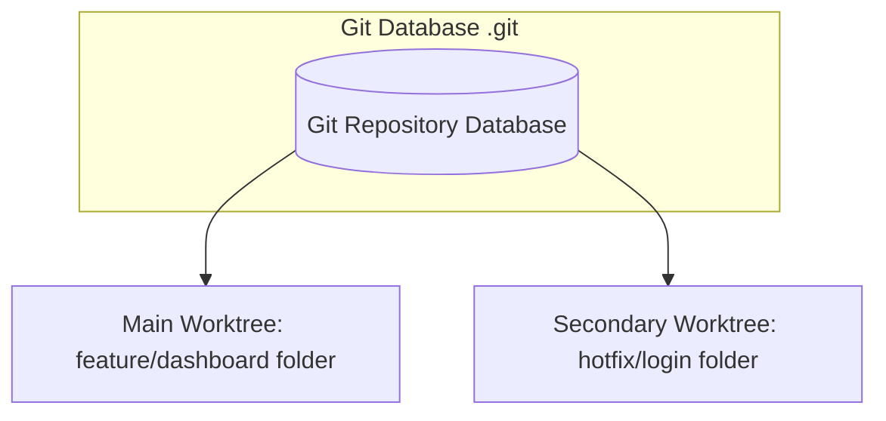

# 23. Git Submodules & Git Worktrees

This chapter covers two advanced repository management concepts: **Git Submodules** (nesting a Git repository inside another Git repository) and **Git Worktrees** (working on multiple branches of the same repository simultaneously in different physical directories).

---

## 1. Git Submodules: Managing Nested Repositories

A submodule is a distinct Git repository nested inside a subdirectory of a host Git repository. Submodules are commonly used to pull in shared library packages, utility frameworks, or dependencies that are actively developed elsewhere.

### Core Submodule Commands

#### A. Add a Submodule
##### Purpose:
Registers and clones a separate external repository into a specific subdirectory of your host repository, creating a `.gitmodules` tracking file.

##### Syntax:
```bash
git submodule add <external-repo-url> <target-folder-path>
```

##### Real-world Example:
```bash
git submodule add https://github.com/company/shared-ui.git src/packages/shared-ui
```

---

#### B. Cloning a Repository with Submodules
##### Purpose:
When you run a standard `git clone <url>`, Git downloads the main repository but leaves all submodule folders completely **empty**. You must initialize and pull down the submodule contents explicitly.

##### Syntax:
```bash
# Option 1: Double-step command
git clone <repo-url>
cd <repo-folder>
git submodule init
git submodule update

# Option 2: Recursive clone (downloads submodules automatically in one command - RECOMMENDED)
git clone --recursive <repo-url>
```

---

#### C. Update Existing Submodules
##### Purpose:
Pulls the latest commits for all registered submodules.

##### Syntax:
```bash
git submodule update --remote --merge
```

---

## 2. Git Worktrees: Multitasking Made Simple

Imagine you are working on a massive feature branch (`feature/dashboard`) with hundreds of modified, uncommitted files. Suddenly, you get a request to fix a production bug immediately.
- **Old way**: Stash your changes, switch to `main`, write the hotfix, commit, switch back, and pop your stash. This is slow and can lead to dirty states.
- **Git Worktree way**: Keep your feature files active exactly as they are. Spin up a separate physical folder (worktree) on your computer pointed to the `main` branch, make the fix, commit, push, and close the folder. No stashing, no checkout interruptions!



### Core Worktree Commands

#### A. Add a Worktree
##### Purpose:
Creates a new physical directory linked to your repository and checks out a target branch in it.

##### Syntax:
```bash
git worktree add <target-folder-path> <branch-name-or-new-branch>
```

##### Real-world Example:
Let's create a temporary directory named `../hotfix-dir` pointed to a new branch `hotfix/stripe`:
```bash
git worktree add ../hotfix-dir -b hotfix/stripe
```
You can now open `hotfix-dir` in a new window of VS Code, run your project, make edits, and commit. Your main worktree directory remains untouched on `feature/dashboard`!

---

#### B. List Active Worktrees
##### Purpose:
Shows all active physical worktree directories linked to the repository.

##### Syntax:
```bash
git worktree list
```

---

#### C. Remove a Worktree
##### Purpose:
Cleans up and deletes a worktree directory after you are done working in it.

##### Syntax:
```bash
# Step 1: Delete the physical folder safely
git worktree remove <worktree-path>

# Step 2: Clean up database references
git worktree prune
```

##### Real-world Example:
```bash
git worktree remove ../hotfix-dir
```

---

## Submodules vs. Worktrees Comparison

| Criteria | Git Submodules | Git Worktrees |
| :--- | :--- | :--- |
| **Concept** | Project dependency (Nested separate repository). | Multitasking (Multiple views of the same repository). |
| **Repositories Involved** | Multiple distinct repositories. | A single repository with multiple directories. |
| **Communication** | Stored as a specific commit SHA in the host repo. | Sharing the same `.git` database directory. |
| **Typical Use Case** | Pulling in a shared CSS library or API package. | Writing a hotfix without stashing feature changes. |

---

## Best Practices
- **Use submodules sparingly**: Submodules can complicate workflows and are difficult to update across branches. If possible, package your dependencies using packaging managers (like NPM, NuGet, or PyPI) instead.
- **Leverage Worktrees for large codebases**: If your project takes a long time to build or compile, switching branches can trigger heavy recompilations. Using worktrees avoids this completely because each directory retains its own build cache!
