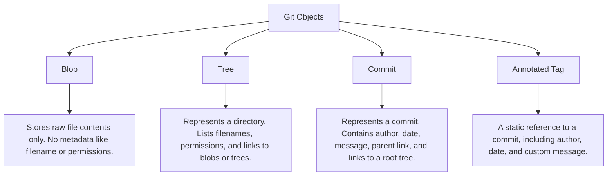
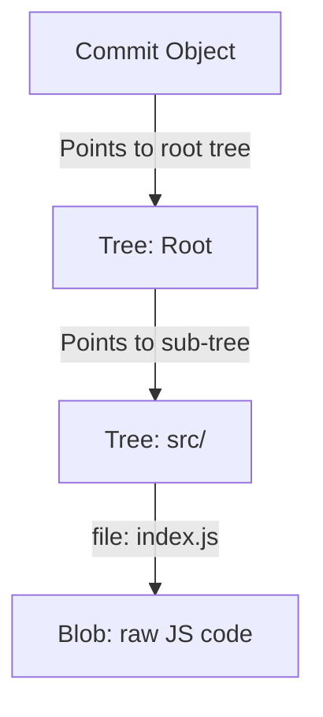

# 25. Git Internals: Under the Hood

To master Git, it is valuable to understand how it operates under the hood. At its core, Git is not just a file tracker; it is a highly optimized, content-addressable key-value store database that translates your directory modifications into structured cryptographic objects.

---

## The Hidden `.git` Directory

When you run `git init`, Git creates a hidden directory named `.git/`. This folder contains the entire database, history, and configuration of your repository:

```text
.git/
├── config          # Repository-specific configuration settings
├── description     # Used by GitWeb (can be ignored)
├── HEAD            # Reference to the currently active branch or commit
├── hooks/          # Folder containing example automation scripts
├── info/exclude    # Local ignore patterns (not shared on GitHub)
├── objects/        # The core database storing all file contents and history
└── refs/           # Pointers to commits (branches, tags, remotes)
```

---

## Git's Four Core Objects

Git stores everything inside the `.git/objects/` folder using SHA-1 cryptographic hashes (40-character hexadecimal strings) as the keys. There are four basic types of Git objects:



### 1. Blobs (Binary Large Objects)
A Blob stores the raw text/binary contents of a file. It does **not** store the filename, the folder location, or permissions.
- If two identical files exist in different folders of your project, Git only stores a single blob object inside database!

### 2. Trees (Directories)
A Tree object represents a directory. It maps filenames, file permissions, and directory locations to the corresponding blob hashes or sub-tree hashes.

### 3. Commits (Version States)
A Commit object points to a single root Tree object representing the state of the repository at that point in time. It also contains metadata: the author, committer, timestamp, commit message, and a reference to the **parent commit(s)** (which forms the historical chain).

---

## How Git Saves a Version (Visualization)

When you make a commit with a single file `src/index.js`, Git constructs the following graph:



If you modify `src/index.js` and commit again, Git:
1. Creates a brand new blob for the modified `index.js`.
2. Creates new Tree objects reflecting the updated hashes.
3. Creates a new Commit object pointing to the new root tree, with its `parent` field pointing to the previous commit hash.
4. **Reuses all unmodified blobs** from the previous commit, making Git extremely storage-efficient!

---

## References (Refs): How Branches Work

Branches and tags in Git are not separate folders. A branch in Git is incredibly lightweight: it is **simply a plain text file containing a 40-character SHA-1 commit hash**.

- **Branch file path**: `.git/refs/heads/main`
- If you open `.git/refs/heads/main` in a text editor, you will see a single line containing a hash (e.g. `8f9e1d2c...`).
- When you create a new branch, Git simply copies that text file to a new name. This is why branch creation in Git is virtually instantaneous!

### HEAD Reference
The `.git/HEAD` file keeps track of which branch you are currently on. It usually contains a reference like this:
```text
ref: refs/heads/main
```
If you switch to a detached HEAD state, Git writes the raw commit hash directly into `.git/HEAD` instead!

---

## Inspecting Git Internals (Plumbing Commands)

Git has two types of commands:
- **Porcelain Commands**: User-facing commands that you use daily (`git checkout`, `git commit`, `git status`).
- **Plumbing Commands**: Low-level commands designed for scripting or debugging Git internals.

### 1. View Git Object Type
##### Purpose:
Identifies what type of object (blob, tree, commit) a specific SHA-1 hash is.

##### Syntax:
```bash
git cat-file -t <hash>
```

---

### 2. View Git Object Contents
##### Purpose:
Prints the raw, uncompressed contents of a Git object.

##### Syntax:
```bash
git cat-file -p <hash>
```

##### Real-world Example (Inspecting a commit hash):
```bash
git cat-file -p 8f9e1d2
```
##### Output:
```text
tree a1b2c3d4e5f6g7h8i9j0...
parent c3b4a2e1d...
author Tanmay Patil <tanmay.patil@example.com> 1716912000 +0530
committer Tanmay Patil <tanmay.patil@example.com> 1716912000 +0530

feat: integrate stripe payment
```

---

## Best Practices
- **Never touch the `.git/objects` folder manually**: Messing with objects directly can corrupt your database. Use standard porcelain or plumbing commands to interact with Git instead.
- **Run Garbage Collection to optimize**: If your repository becomes bloated over time, run Git's built-in cleanup utility to compress files and optimize repository performance:
  ```bash
  git gc --prune=now
  ```
