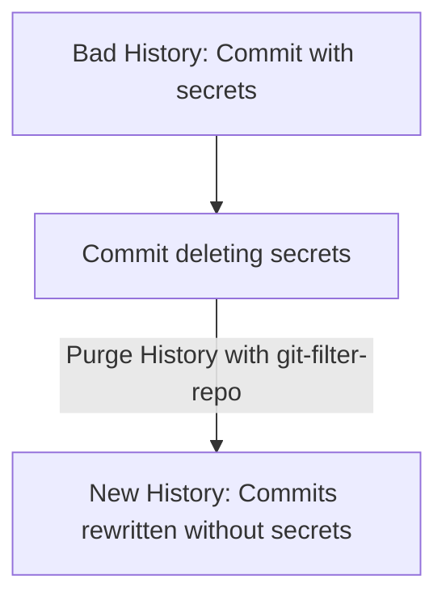

# 27. Git Security Best Practices & History Purging

Maintaining secure repositories is critical in professional development. If private API keys, database credentials, or SSH certificates are accidentally committed to GitHub, malicious scrapers can scan and exploit them within seconds. This chapter covers GPG Commit Signing, credential management, and how to safely purge sensitive data permanently from your Git history.

---

## 1. GPG Commit Signing: Verifying Authorship

In Git, anyone can configure their local username to match yours (`git config user.name "Your Name"`). When they push commits to GitHub, it will appear as though you wrote them, presenting a major security risk. **Signed Commits** solve this by using GPG (GNU Privacy Guard) key pairs to cryptographically sign your commits. GitHub displays a verified badge next to signed commits.


### Setting Up Commit Signing

#### Step 1: Generate a GPG Key Pair
1. Download and install **GPG Suite** (macOS) or **Gpg4win** (Windows).
2. Generate a key pair in your terminal:
   ```bash
   gpg --full-generate-key
   ```
   *Choose `RSA and RSA` (default), key size `4096` bits, select expiration, and fill in your name and email (must match your GitHub email).*

---

#### Step 2: Retrieve the GPG Key ID
List your GPG keys to find the Key ID:
```bash
gpg --list-secret-keys --keyid-format=long
```

##### Output:
```text
sec   rsa4096/3AA5C34371567BDD 2026-05-28 [SC]
uid           [ultimate] Tanmay Patil <tanmay.patil@example.com>
```
*Your GPG Key ID is the 16-character hexadecimal value following the algorithm: **`3AA5C34371567BDD`**.*

---

#### Step 3: Add the Public Key to GitHub
1. Export the public key in ASCII armor format:
   ```bash
   gpg --armor --export 3AA5C34371567BDD
   ```
2. Copy the entire output block (starting with `-----BEGIN PPG PUBLIC KEY BLOCK-----`).
3. Open GitHub settings -> **SSH and GPG keys** -> **New GPG Key**, paste the block, and save.

---

#### Step 4: Configure Local Git to Sign Commits
Tell Git to use this specific key and automatically sign all future commits:
```bash
# Tell Git GPG key ID
git config --global user.signingkey 3AA5C34371567BDD

# Enable automatic commit signing globally
git config --global commit.gpgsign true
```

---

## 2. Secure Credential Helpers

Instead of typing your personal developer token or passphrase repeatedly, configure a secure OS-native credential helper:

```bash
# On Windows (uses secure Windows Credential Manager)
git config --global credential.helper wincred

# On macOS (uses secure Keychain Access)
git config --global credential.helper osxkeychain

# On Linux
git config --global credential.helper cache
```

---

## 3. Purging Sensitive Data from Git History

If you committed a secret key to your repository, simply deleting the file and making a new commit **does not solve the leak**. The secret key is still visible in your previous historical commits. You must completely rewrite history to delete every reference to that file.



### The Modern Way: Using `git-filter-repo`
Historically, developers used `git filter-branch` to rewrite history, but it is deprecated, slow, and easily corrupts databases. The modern standard is **`git-filter-repo`** (a Python-based tool).

#### Step 1: Install `git-filter-repo`
```bash
# Windows (using winget)
winget install Python.Python
pip install git-filter-repo

# macOS (using Homebrew)
brew install git-filter-repo
```

#### Step 2: Purge a Specific File containing Secrets
Navigate to your repository and run the filter tool to delete the file and rewrite all historical commits:
```bash
# WARNING: This operation is destructive and rewrites history!
git filter-repo --path config/secrets.json --invert-paths
```
*The `--invert-paths` flag instructs Git to delete the specified path and keep everything else.*

#### Step 3: Purge a Secret String from All Files
If you committed a specific API key string (e.g. `sk_live_51M4B7c...`) and want to replace it with `REDACTED` across every file and every commit in history:
1. Create a text file named `expressions.txt` containing:
   ```text
   sk_live_51M4B7c...==>REDACTED
   ```
2. Run the expression purge:
   ```bash
   git filter-repo --replace-text expressions.txt
   ```

#### Step 4: Force Push the Rewritten History
Since you rewrote the repository's cryptographic hashes, you must force push the updates to GitHub:
```bash
git push origin --force --all
git push origin --force --tags
```
*Note: Instantly rotate/revoke the leaked credentials immediately! Even if you purged it from Git history, scraping bots could have recorded the key the moment you originally pushed it.*

---

## Best Practices
- **Never push credentials**: Always use environment variables (`.env` files) and check them out of Git using `.gitignore`.
- **Use GPG keys for verified badges**: It verifies that your commits are authentically yours, protecting your professional identity.
- **Install `git-secrets`**: Use automated tools (like AWS's `git-secrets` or Yelp's `detect-secrets`) as pre-commit hooks to scan files and block commits if private keys are accidentally added.
