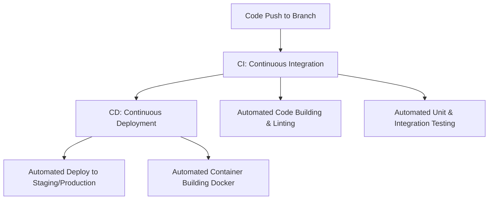

# 28. CI/CD Basics with GitHub Actions

Modern software engineering relies heavily on automation. Continuous Integration (CI) and Continuous Deployment (CD) automate the building, testing, and deployment of your code directly from your Git repository. **GitHub Actions** is GitHub's built-in CI/CD orchestration engine, allowing you to trigger custom workflows automatically whenever a developer pushes a branch, tags a release, or opens a pull request.

---

## 1. Core CI/CD Concepts



- **Continuous Integration (CI)**: The practice of automatically building and testing your code every time a team member pushes changes. This catches integration bugs immediately.
- **Continuous Deployment (CD)**: Taking CI a step further: once the code successfully passes all tests, it is automatically deployed to staging or production servers without manual intervention.

---

## 2. GitHub Actions YAML Workflow Structure

GitHub Actions uses **YAML** configuration files stored inside a special directory in your repository:

```text
my-project/
├── .github/
│   └── workflows/
│       └── ci-checks.yml   # Your CI pipeline configuration
├── src/
└── package.json
```

---

## Complete Production-Ready CI Workflow Example

Here is a practical, production-ready GitHub Actions YAML file (`.github/workflows/ci-checks.yml`) that triggers on every push or pull request to the `main` branch. It sets up Node.js, installs dependencies, runs Prettier formatting checks, checks for linting errors, and runs unit tests:

```yaml
name: CI Code Checks

# 1. Define when this workflow should trigger
on:
  push:
    branches: [ main, develop ]
  pull_request:
    branches: [ main ]

# 2. Define the list of jobs to run
jobs:
  build-and-test:
    # Run the tests on an isolated Ubuntu virtual machine
    runs-on: ubuntu-latest

    # Define the sequence of steps inside the job
    steps:
      # Step 1: Download/Checkout your code repository onto the VM
      - name: Checkout Repository
        uses: actions/checkout@v4

      # Step 2: Set up the correct Node.js environment
      - name: Setup Node.js
        uses: actions/setup-node@v4
        with:
          node-version: '20'
          cache: 'npm'

      # Step 3: Install dependencies using clean install (ci)
      - name: Install Dependencies
        run: npm ci

      # Step 4: Run Prettier formatting checks
      - name: Check Code Formatting
        run: npm run format:check

      # Step 5: Run ESLint to catch syntax/bug patterns
      - name: Lint Source Code
        run: npm run lint

      # Step 6: Execute unit tests
      - name: Run Unit Tests
        run: npm run test
```

---

## Key Vocabulary in GitHub Actions

- **Workflows**: The complete automated process configured in a single YAML file.
- **Events**: Trigger points that launch the workflow (e.g. `push`, `pull_request`, `release`).
- **Jobs**: A set of steps that execute on a fresh virtual runner environment. By default, multiple jobs inside a workflow run in parallel.
- **Steps**: Individual execution commands or actions inside a job.
- **Actions**: Pre-packaged reusable code steps (like `actions/checkout@v4`) that simplify complex operations.

---

## Bypassing Actions (Skipping CI)

If you make a minor documentation change or update a README, running the entire CI suite is a waste of time and resources. You can instruct GitHub Actions to skip the workflow by adding specific tags inside your commit message:

##### Syntax:
Add `[skip ci]`, `[ci skip]`, `[skip actions]`, or `[actions skip]` to your commit message:

```bash
git commit -m "docs: correct spelling in landing page [skip ci]"
git push origin main
```
*GitHub will record the commit but bypass the automated workflow completely.*

---

## Best Practices
- **Cache dependencies**: Always cache dependencies (e.g. `uses: actions/setup-node@v4` with `cache: 'npm'`) to speed up your pipeline builds from minutes to seconds.
- **Configure branch protection**: Set up branch protection rules on GitHub to block merges if the CI build job fails, ensuring `main` always remains stable.
- **Keep secrets secure**: Never paste API keys directly into your YAML file. Store them inside GitHub **Settings** -> **Secrets and variables** -> **Actions** and reference them securely:
  ```yaml
  env:
    STRIPE_API_KEY: ${{ secrets.STRIPE_LIVE_KEY }}
  ```
