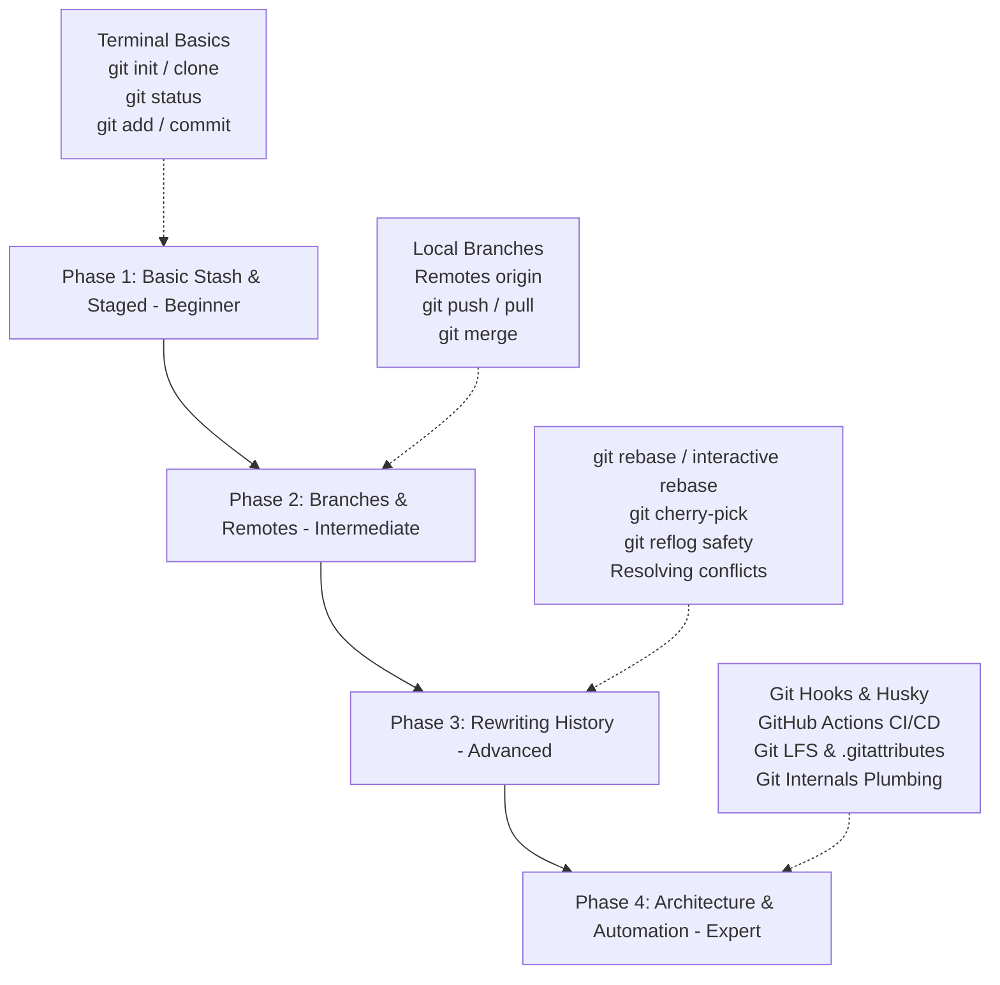

# 30. The Progressive Git Mastery Roadmap

Mastering Git takes time. It is not about memorizing every obscure command; it is about building a solid mental model of how Git stores data and structures history. This final chapter provides a progressive roadmap to guide you from Git beginner to Git expert, suggests modern development tools, and highlights premium external resources.

---

## 🗺️ Progressive Learning Path

---

## 💻 Recommended Developer Tooling

While using the Command Line Interface (CLI) is vital to understanding Git, combining it with visual tools speeds up code reviews and helps resolve complex merge conflicts:

### 1. VS Code Extensions
- **GitLens**: An extremely feature-rich extension that displays inline authorship logs (blame), traces history changes, and offers rich branch visualizations.
- **Git History**: Simplifies viewing log history, comparing files across branches, and tracking changes visually.
- **Git Graph**: Renders a beautiful interactive branch tree where you can perform cherry-picks, merges, and checkouts with a mouse click.

### 2. Standalone Graphical User Interfaces (GUIs)
- **Fork**: A highly responsive, premium-designed Git client with side-by-side diff viewers and interactive rebase features.
- **GitHub Desktop**: A clean, beginner-friendly interface that integrates beautifully with GitHub.
- **Sourcetree**: A free, feature-rich Git client built by Atlassian for managing complex branch workflows visually.

---

## 📚 Elite External Resources

### 1. Interactive Tutorials
- **[Learn Git Branching](https://learngitbranching.js.org/)**: The absolute best interactive, visual game that walks you through branch merges, rebases, and cherry-picks.
- **[Oh My Git!](https://ohmygit.org/)**: An open-source card game that visualizes Git structures in real-time.

### 2. Documentation & Reference Manuals
- **[Pro Git Book](https://git-scm.com/book/en/v2)**: The definitive, official guide to Git. Available completely free online. Written by Scott Chacon and Ben Straub.
- **[GitHub Docs](https://docs.github.com/)**: Excellent guides on managing SSH keys, forks, PR templates, and workflow automations.

### 3. Cheat Sheets & Quick References
- **[GitHub Git Cheat Sheet](https://training.github.com/downloads/github-git-cheat-sheet.pdf)**: The official PDF cheat sheet containing core CLI commands.
- **[First Aid Git](https://firstaidgit.io/)**: A search-focused database of quick recovery recipes for common Git mistakes.

---

## Final Best Practices
- **Commit frequently, push selectively**: Save commits locally as you code to keep your backup steps granular. Push them to the remote server only when you are ready to share or request review.
- **Never be afraid of Git**: Since Git has `git reflog`, it is nearly impossible to delete anything permanently. Experiment freely, try new commands, and know that you can always reset back to a safe state!
